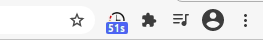
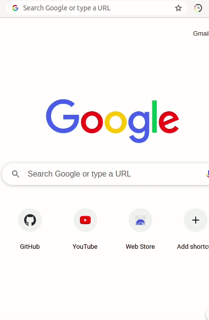
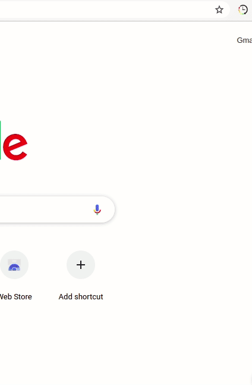

# Web-Time Tracker 

A Chrome Extension that keeps track of the time you spend on various websites, each day.

## Installation
1. Download the source code as ZIP and extract it to any location.
2. Open [chrome://extensions/](chrome://extensions/) in your Chrome browser and enable **Developer mode** on the top right corner.
3. Click on **Load unpacked** and select the location of unzipped source folder.

## Features 
* Badges to display time spent on each site.   
* Detailed view of sites visited today.   
* Select a date and view time spent details   
* Quick summary of online time trends for the past week.    

## Contributors
[@Shankar203](https://github.com/Shankar203)
[@vrrao01](https://github.com/vrrao01)
